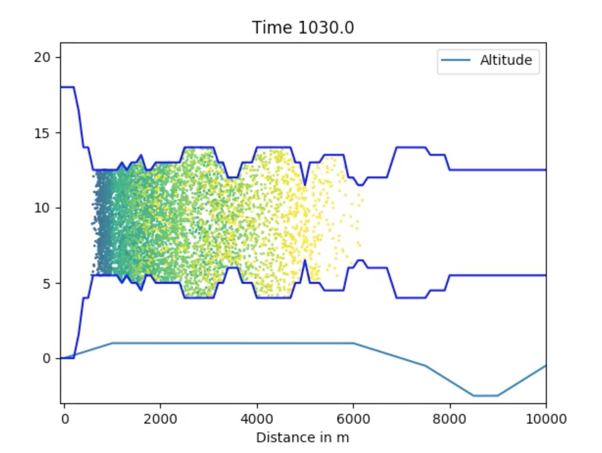

# Code for the Lap2Go Project at the ESGI140 in Portugal

Installation instructions:

    git clone git@github.com:florianwechsung/ESGI140.git
    cd ESGI140
    mkdir build
    cd build
    cmake ..
    make
    export PYTHONPATH=`pwd`:$PYTHONPATH

Then run the sample code by doing

    cd ../python/
    python driver.py

This will produce a video looking with the race simulation:

